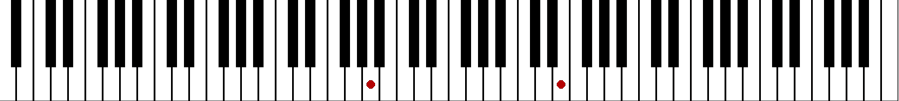

# Piano Visualizer Engine

## Project Demo (프로젝트 데모)


## Project Overview (개요)
"표준 .mid 파일을 직접 설계한 커스텀 .json 포맷으로 파싱하여, 60 FPS 환경에서 실시간으로 시각화 및 사운드를 동기화하는 피아노 비주얼라이저 엔진입니다."

## Key Features (주요 기능)
* pretty_midi 기반의 자동 데이터 파이프라인 구축
* 프레임 누락 방지를 위한 시간 정렬 이벤트 큐(Queue) 연산 최적화
* 콘솔 입력을 통한 곡 선택, 실시간 재생 배속 제어, 특정 마디 구간 재생 기능

## Structure (구조)
```text
├── midi_files/            # 사용자가 다운로드한 원본 표준 MIDI (.mid) 파일 보관 폴더
├── json_files/            # 파이프라인을 통해 자동 생성/캐싱되는 박자 데이터 (.json) 폴더
├── main.py                # 메인 오케스트레이터 (CLI 인터페이스 및 60 FPS 메인 루프 제어)
├── midi_to_json.py        # MIDI ➡️ Custom JSON 자동 변환 및 파이프라인 최적화
├── refine_measure_data.py # 이벤트 드리븐(Note-On/Off) 데이터 포맷 정제 함수
├── draw_piano.py          # 88건반 정적 그래픽 렌더링 모듈
├── key_state.py           # 건반 활성화 상태 관리 및 흑/백 건반 실시간 좌표 매핑
├── requirements.txt       # 프로젝트 의존성 라이브러리 리스트
└── README.md              # 프로젝트 명세서 및 개발 로그 (본 문서)
```

## How to Run (실행 방법)
1. pip install -r requirements.txt
2. 실행할 `.mid` 파일을 'midi_files' 폴더에 넣어줍니다.
3. python main.py (실행)
4. 콘솔 입력으로 곡, 재생 속도, 재생할 마디 범위를 지정합니다.

## 🧠 Development Log & Insights (개발 로그 & 시행착오) 

이 프로젝트는 기존의 오픈소스나 템플릿을 단순히 복사한 것이 아니라, 개발 과정에서 마주한 한계를 데이터 구조 설계와 논리적 리팩토링을 통해 직접 해결해 나간 기록입니다.

### 1. 음악 데이터의 표준을 찾다: 건반 인덱싱과 MIDI 프로토콜
* **문제 정의:** 88개 피아노 건반을 프로그램 내부에서 어떻게 정수로 매핑하고 제어할 것인가에 대한 기준이 필요했습니다.
* **해결 과정:** 바닥에서부터 리서치를 진행하던 중, 국제 표준 프로토콜인 **MIDI Number(중간 도 C4 = 60)**의 존재를 발견했습니다. 이를 통해 화면 렌더링 좌표와 건반의 주파수 매핑을 직관적인 정수 인덱스 체계로 통합할 수 있었습니다.

### 2. 데이터 타협 없는 3대 요소의 정의
* **구현 핵심:** 악보라는 방대한 정보를 데이터화하기 위해 절대로 타협할 수 없는 **3가지 핵심 데이터**를 정의했습니다.
  * `Pitch` (음의 높낮이)
  * `Start` (음이 시작되는 타이밍)
  * `Duration` (음이 유지되는 길이)
* **결과:** 이 세 가지 본질적인 데이터만을 정제하여 담아낼 수 있는 커스텀 `.json` 포맷을 직접 설계하여 파싱 파이프라인의 기초를 다졌습니다.

### 3. 시간 단위(Seconds)에서 박자 단위(Beat)로의 개념 전환
* **마주한 한계:** 처음에는 모든 이벤트를 절대적인 시간(초 단위)으로 계산하여 배치하려 했습니다. 그러나 초 단위 데이터는 곡의 템포(BPM) 변화에 유연하게 대응하기 어려웠고, 음악의 본질적인 흐름을 왜곡할 위험이 있었습니다.
* **의사 결정:** 음악의 논리적 최소 단위는 시간이 아니라 **박자(Beat)**라는 결론에 도달했습니다. 
* **개선:** 데이터 구조를 '누적 박자 수' 기준으로 리팩토링하여, 곡의 속도(BPM)가 변하더라도 마디와 박자의 물리적 위치가 절대 밀리지 않는 견고한 멀티미디어 엔진을 완성했습니다.

### 4. 핵심 아이디어: 양수/음수를 활용한 이벤트 트리거 설계
* **마주한 한계:** 하나의 마디 안에 수많은 음표가 나열된 구조(Raw Data)는 "특정 프레임에 어떤 건반을 켜고 꺼야 하는지" 실시간으로 판단하기에 연산 낭비가 심했고, 화음(Chord)과 연타 처리가 까다로웠습니다.
* **독창적 해결책:** 데이터를 구조적으로 완전히 재배치하여 **'이벤트 드리븐(Event-Driven)'** 방식으로 전환했습니다.
  * **양수 (+Pitch):** 건반을 누르는 이벤트 (**Note-On**)
  * **음수 (-Pitch):** 건반에서 손을 떼는 이벤트 (**Note-Off**)
* **기대 효과:** 60 FPS로 작동하는 메인 루프에서는 현재 시간에 걸리는 이벤트만 단순 리스트 연산으로 처리하면 되므로, 화음이 발생해도 CPU 연산 낭비 없이 완벽한 싱크로 시각화를 구현할 수 있게 되었습니다.
### 5. 사용자 경험(UX) 개선: 자동 캐싱 파이프라인과 CLI 인터페이스 통합
* **마주한 한계:** 기존 방식은 사용자가 곡을 재생하기 전에 `midi_to_json.py`를 수동으로 직접 실행하여 `.mid` 파일을 `.json`으로 먼저 변환해야 했습니다. 이는 실행 절차가 파편화되어 번거로울 뿐만 아니라, 프로그램의 내부 구조를 모르는 일반 사용자 관점에서는 결코 친화적이지 못한 방식이었습니다.
* **해결 과정:** `main.py`가 실행될 때 현재 폴더 안의 `.mid` 파일 목록을 자동으로 검색하고, 사용자가 곡을 선택하면 그에 대응하는 `.json` 파일이 이미 존재하는지 검증하는 로직을 구현했습니다. 파일이 없다면 배후(Background)에서 자동으로 변환 함수를 호출하여 `.json`을 생성한 뒤 읽어오고, 이미 존재한다면 무의미한 재변환을 스킵하고 즉시 로드하는 일종의 '캐싱(Caching) 시스템'을 구축했습니다.
* **결과:** 사용자가 소스코드를 단 한 줄도 건드리지 않고, 여러 스크립트를 번갈아 실행할 필요도 없이, 오직 하나의 콘솔(CLI) 창 인터페이스만으로 파일 탐색, 파일 자동 변환, 재생 속도 제어, 마디 구간 재생까지 모든 프로세스를 제어할 수 있는 '사용자 중심의 원스톱(One-Stop) 시스템'을 완성하여 제품 수준의 UX를 확보했습니다.